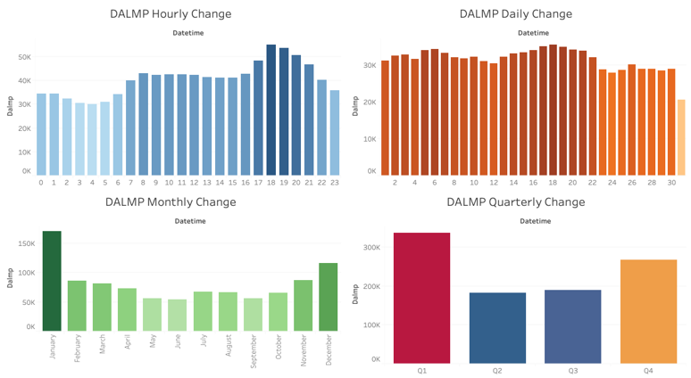
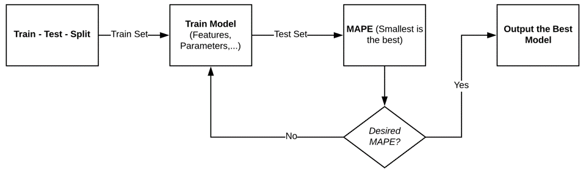
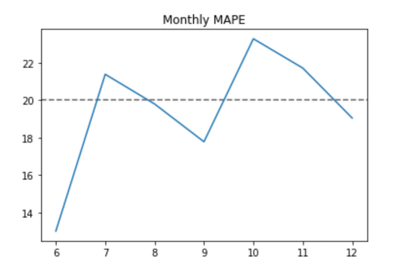

# Electricity Price Forecasting
This project is a capstone project with NextEra Energy, Inc.   
My biggest contribution was that I developed a new time series model that would be added to the company's forecasting tool pool.  
The most valuable thing I learned was that how to design different metrics to evaluate model performance and then improve model correspondly.

## 1. Introduction
The project aimed to predict hourly energy prices from 0 am to 23 pm to help the business team at NextEra Energy, Inc. to get a more competitive bid at the Day-ahead market.  
The data scientist team at NEE was interested in seeing if the student team could provide any novel approach for price prediction.   

Our team decided to develope a [Prophet](https://facebook.github.io/prophet/) time series model, a brand-new model that had never been implemented before.

## 2. Data 
The company provided us with an internal dataset, containing weather data, price data, and load data. 
**Data Range:** 2017-03-01 00:00:00 to 2020-03-02-23:00.  

**Training Data:** 2017-03-01 00:00:00 - 2019-05-31 23:00:00  
**Test Data:** 2019-06-01 00:00:00 - 2019-12-31 23:00:00  
*We excluded data in 2020, because it's higly possible that the price would reveal new pattern due to the COVID-19 pandemic.*
*For credential reason, I cannot upload the dataset.*

## 3. Code Implementation
### 3.1 Preprocessing data
I did data quality check on the dataset and performed data cleaning in Python, including Lable Encoding.

### 3.2 Feature engineering
The team discovered multiple seasonalities of energy pricing, such as daily trend, weekly trend, and yearly trend. And then created corresponding features. 

### 3.2 Prophet model
I collaborated with my teammate to learn the Prophet model through reading official document, public examples, and practice.  
Prophet was a very powerful model that could provide accurate and fast result, and was capable in forecasting prices accurately in a long time period, while ARIMA could not achieve it. [Check out more here](https://facebook.github.io/prophet/)  
**Model-building-Flow-Chart**  

**Prediction Visual**  
 
The part didn't have black points was the prediction period. The Prophet model captured the upward trend at the second half year well.

### 3.3 Error Metrics  
I chose MAPE to analyze the model performance.  
I calculated overall MAPE, MAPE without outliers, and monthly MAPE. I found MAPE varied in different months.   
  
A solution was to develope forecasting models *month by month*.

## 4. Summary
The prophet model was worth using for energy price prediction. It could help the data science team as well as the business team to form a better idea of how the prcie will go in the following few days/weeks.
